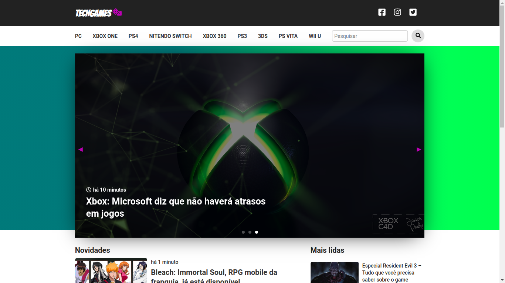
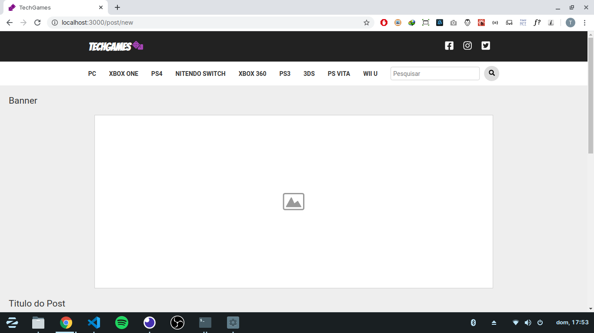
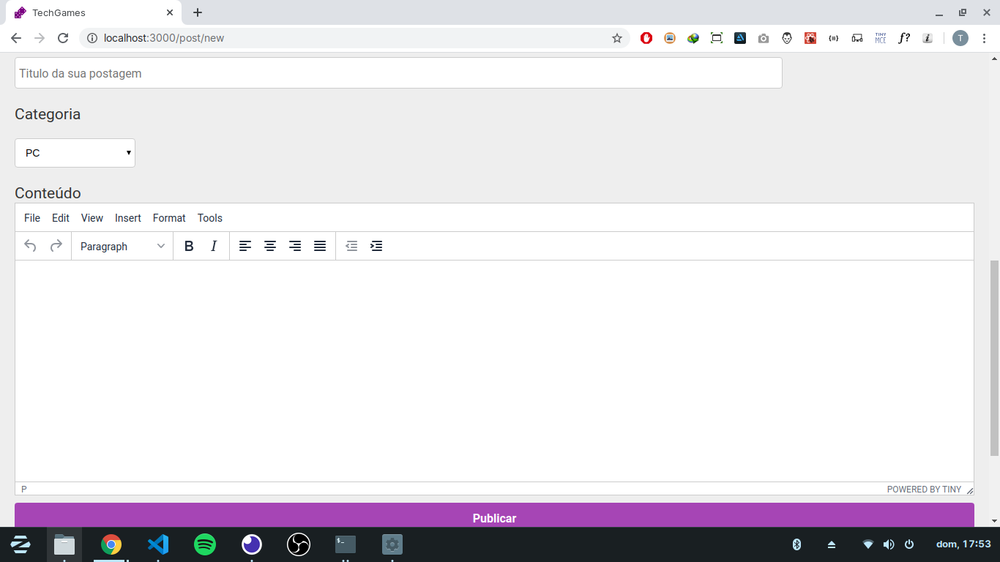
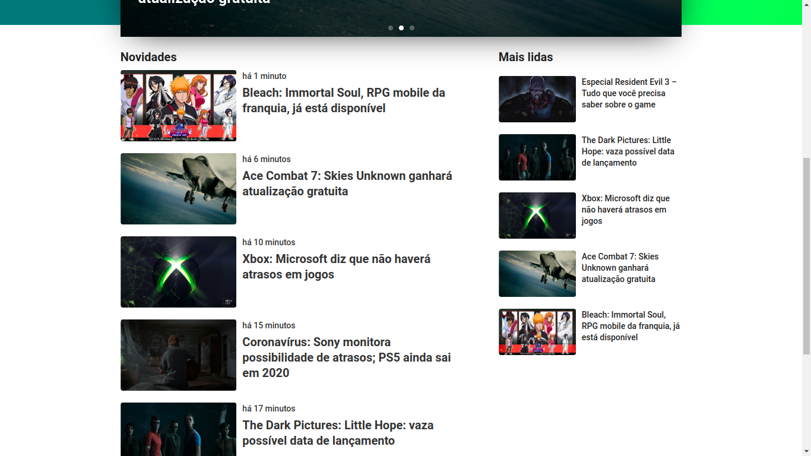
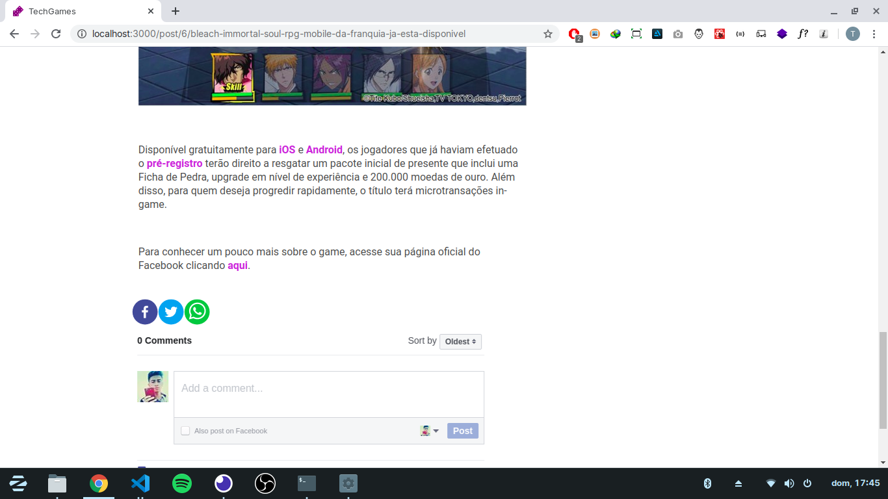
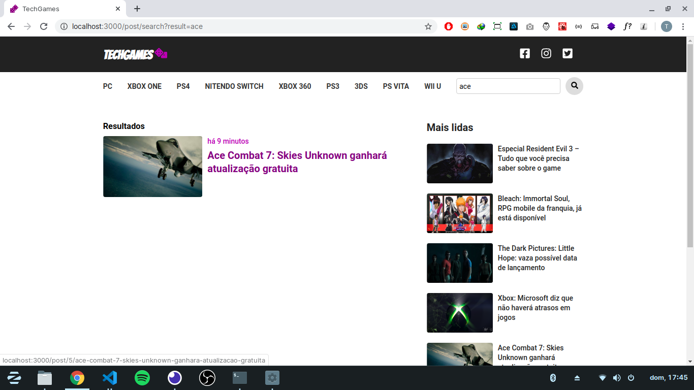
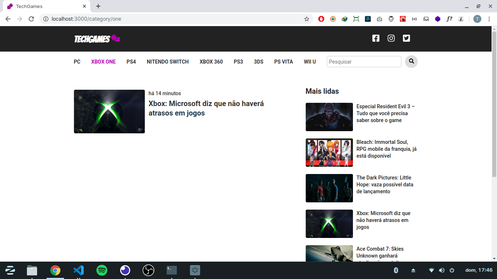

# TECHGAMES

TechGames is a complete gaming news portal



## Technology
- NodeJS
- ReactJS
- Postgres
- DateFNS
- Sequelize
- Sucrase

## Features

The portal has a posting system where the administrator places the post banner, title, category and post content, in which I implemented Tinymce to convert my text to HTML.





On the home page, all posts are ranked by the most recent. I used Date-FNS to calculate how much time has passed since posting.



This is what it looks like when the user clicks on the post. Making it possible to watch videos and etc.


The user can share the post on social networks, as well as comment on it using Facebook.



The portal also has a search system.



There is also the possibility to see posts by category.



## How to run

1. Clone the project.

2. When cloning, open both backend and frontend folder in an editor of your preference, install the dependencies on your terminal by typing:

```sh
yarn or npm
``` 

3. If you use docker, install a postgres container, otherwise install a postgres server on your machine. With that done, in the backend folder run migrations, typing:

```sh
yarn sequelize db:migrate or npx sequelize db:migrate
```

4. With that done, start both backend and frontend servers by typing:

```sh
yarn dev or npx dev
``` 

5. Quando abrir o navegador, acesse a rota 'http://localhost:3333/post/new' para adicionar uma nova postagem.
